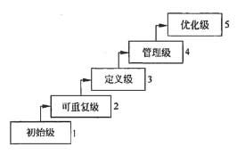

#### 软件过程能力成熟度模型(CMMI)

软件能力成熟度模型(CMM)是目前国际上最流行、最实用的软件生产过程标准和软件企业成熟度的等级认证标准。该模型将软件能力成熟度自低到高依次划分为初始级、可重复级、已定义级、己管理级、优化级。从（ B ）开始，要求企业建立基本的项目管理过程的政策和管理规程，使项目管理工作有章可循。

 A.初始级

B.可重复级

C.已定义级

D.已管理级

CMM是美国卡内基一梅隆大学软件工程研究所与企业、政府合作的基础上开发的模型，主要用于评价软件企业的质量保证能力。CMM为软件企业的过程能力提供了一个阶梯式的进化框架，将软件过程改进的进化步骤分为5个成熟度等级，每个等级定义了一组过程能力目标，并描述了要达到这些目标应采取的实践活动，为不断改进过程奠定了循序渐近的基础.这个等级的层次关系如下图所示。图中的初始级是起点，该等级的企业一般缺少有效的管理，项目进行过程中常放弃最初的规划，开发项目成效不稳定。而从可重复级开始，每个级别都设定了一组目标，且低级别目标的实现是实现高级别目标的基础。

可重复级要求企业建了基本的管理制度和规程，管理工作有章可循，初步实现开发过程标准化。定义级要求整个软件生命周期的管理和技术工作均己实现标准化、文档化，并建立完善的培训制度和专家评审制度，项目质量、进度和费用均可控制。在管理级，企业的软件过程和产品己建立定量的质量目标，并通过一致的度量标准来指导软件过程，保证项目对生产率和质量进行度量，可预测过程和产品质量趋势。在优化级，企业可集中精力改进软件过程，并拥有防止出现缺陷、识别薄弱环节及进行改进的手段。

