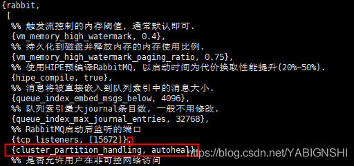

rabbitmq 脑裂问题，实质上是个网络分区问题， 确切来说是网络不稳定导致的问题。

rabbitmq集群的网络分区容错性不好，在网络比较差的情况下容易出错，最明显的就是脑裂问题了。

不要将你的rabbitmq集群建立在广域网上，除非你使用federation或者shovel等插件。

> 所谓的脑裂问题，就是在多机集群中节点与节点之间失联，都认为对方出现故障，而自身裂变为独立的个体，各自为政，那么就出现了抢夺对方的资源，争抢启动，至此就发生了事故。

举个栗子：

A和B是集群上的两个节点，分别拥有一部分集群的数据a，b， 如果这时发生分区问题，两个节点无法通信，A以为B宕机，B以为A宕机，于是就出现了：

如果A存在B的备份，那就以完整数据运行，B存在A的数据备份，也是同样， 那这里就造成共享数据损坏。

如果 A,B 各自仅拥有a,b 的数据，那要么都无法恢复/启动，要么就瓜分数据运行。


#### 分区现象

它会在rabbitmq UI界面上提醒

>Network partition detected
>Mnesia reports that this RabbitMQ cluster has experienced a network partition. There is a risk of losing data. Please read RabbitMQ documentation about network partitions and the possible solutions.


#### 判定条件

默认情况下，一个节点在60s之内不能连接上另一个节点（可用net_ticktime 参数调整），就判定这个节点挂了。即使之后节点网络又连通了，由于节点都认为对方挂了，所以Mnesia 还是会发送网络分区的情况并且将情况记录在日志中。（许多围绕网络分区的细节都与Mnesia的行为相关。Mnesia是一个分布式数据库管理系统(DBMS),适合于电信和其它需要持续运行和具备软实时特性的Erlang应用，是构建电信应用的控制系统平台开放式电信平台(OTP)的一部分。）

除了网络失败原因，操作系统的挂起和恢复也会导致集群内部节点发生分区， 因为发生挂起的节点不会认为自己已经失败或者不能工作，但是其他节点会这么认为。比如：将节点运行在你的电脑上，你合上电脑；或者你将节点运行在虚拟机里，系统管理程序将节点挂起了。


#### 如何恢复

人力干扰：

1. 部分重启。选择受信分区即网络环境好的分区，重启其他分区，让他们重新加入受信分区中，之后再重启受信分区，消除警告⚠️
2. 全部重启。停掉整个集群，然后启动，不过要保证第一个启动的是受信分区。不然还没等所有节点加入，自己就挂了。

自动处理：

rabbitmq 提供了3种模式

ignore 默认配置，即分区不做任何处理。要使用这种，就要保证网络高可用，例如，节点都在一个机架上，用的同一个交换机，这个交换机连上一个WAN，保证网络稳定。

pause_minority。优先暂停‘少数派’。就是节点判断自己在不在‘少数派’（少于或者等于集群中一半的节点数），在就自动关闭，保证稳定区的大部分节点可以继续运行。

autoheal， 关闭客户端连接数最多的节点。 这里比较有意思，rabbitmq 会自动挑选一个“获胜”分区，即连接数最小的，重启其他分区。（如果平手，就选节点多的，如果节点也一致，那就以未知方式挑选‘获胜者’）。这个更关心服务的连续性而不是数据的完整性。


#### 临时解决办法

在出现问题的节点上执行: rabbitmqctl stop_app 

在出现问题的节点上执行: rabbitmqctl start_app 

注意：mq集群不能采用kill -9 杀死进程，否则生产者和消费者不能及时识别mq的断连，会影响生产者和消费者正常的业务处理。


#### 配置脑裂后自动修复

在/etc/rabbitmq下新建rabbitmq.conf，加入：

```json
[
  {rabbit,
   [{tcp_listeners,[5672]},
   {cluster_partition_handling, autoheal}
   ]}
]
```

若已有配置文件，则直接添加`{cluster_partition_handling, autoheal}`配置，示例：`vi /etc/rabbitmq/rabbitmq.config`




#### 重启

```sh
systemctl restart rabbitmq-server
```

