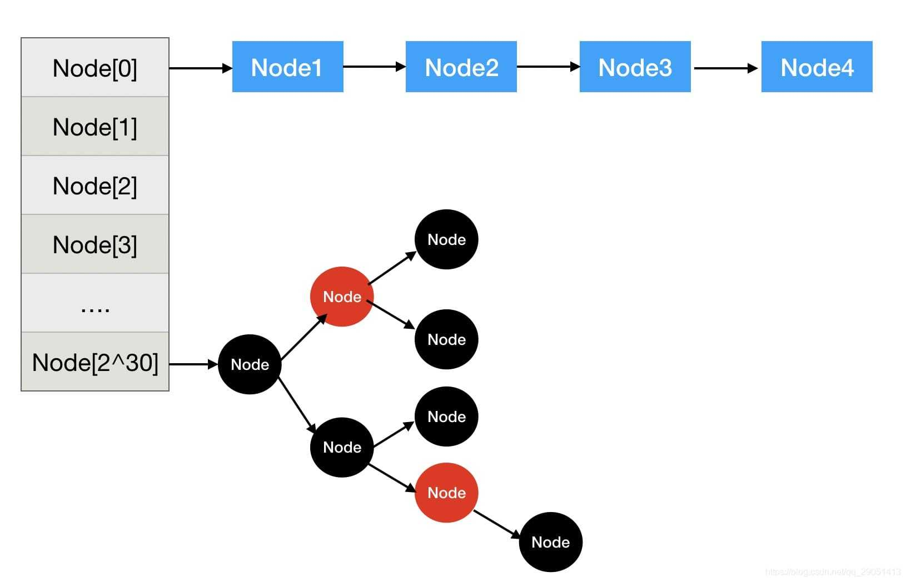

[参考文章1](https://blog.csdn.net/qq_29051413/article/details/107840460)

[参考文章2](https://www.cnblogs.com/lqlqlq/p/11932117.html)

**再散列解决hash冲突**




怎样确定下标呢？==散列==——通过对象的特征(hashCode)，确定它应该放在哪个下标的过程。

> 怎么把hashCode映射到下标的二进制码上呢？
>
> 假设hashCode是8位的（实际上是32位的），hashCode：`0111 0111`
>
> 假如数组的大小是16，那么要根据hashCode确定好数组下标（0-15）
>
> ==直接低四位映射，高四位置0（范围会保持在0-15）==：`0000 0111`，转为十进制`7`。
>
> 但是如果低四位相同，都会映射到同一数组下标上。
>
> 
>
> 高位有2 ^ 4 = 16种情况，都会映射到同一个数组下标，何况实际上hashCode是32位的，这样的话就有2 ^ (32-4) = 2 ^ 28种冲突，这样许多甚至所有对象组成一条链表挂在一个位置上，查询效率十分低。
>
> ==这种对不同对象进行散列，但最后得到的下标相同的情况称为hash冲突。==


#### 0. JDK 8如何执行散列

---

>JDK 8使用了掩码，掩码是根据HashMap存储对象的数组大小决定的，table就是hash表，`n-1`被作为掩码和传进来的`hashCode`进行&运算。
>
>```java
>public V get(Object key) {
>  Node<K,V> e;
>  return (e = getNode(hash(key), key)) == null ? null : e.value;
>}
>
>final Node<K,V> getNode(int hash, Object key) {
>  Node<K,V>[] tab; Node<K,V> first, e; int n; K k;
>  if ((tab = table) != null && (n = tab.length) > 0 &&
>      (first = tab[(n - 1) & hash]) != null) {
>    if (first.hash == hash && // always check first node
>        ((k = first.key) == key || (key != null && key.equals(k))))
>      return first;
>    if ((e = first.next) != null) {
>      if (first instanceof TreeNode)
>        return ((TreeNode<K,V>)first).getTreeNode(hash, key);
>      do {
>        if (e.hash == hash &&
>            ((k = e.key) == key || (key != null && key.equals(k))))
>          return e;
>      } while ((e = e.next) != null);
>    }
>  }
>  return null;
>}
>```

>例子：
>
>比如大小为32的hash表，那么(n - 1)  = 32 - 1 = 31 = `0001 1111`
>
>`0001 1111 & hash`，==0001 1111像一块掩布，将和它与运算的hash值的前三位都遮住，全部变成0，其他位不变==，所以被称为掩码。
>
>比如hash = 1101 0101，会将前三位全部掩盖掉，掩码后面的1与hash值与运算后保持不变。
>
>`(n - 1)  & hash = 0001 0101 = 21`

>**源码中hashCode是怎么减少冲突的？**
>
>java.util.HashMap#hash方法就是把hashCode再散列一次，把散列hashCode后的值作为返回值返回，以此再次减少冲突，而过程是把高位的特征性传到低位。
>
>```java
>static final int hash(Object key) {
>  int h;
>  return (key == null) ? 0 : (h = key.hashCode()) ^ (h >>> 16);
>}
>```
>
>- 计算hashCode；
>- ==把高位二进制序列（比如0110 0111中的`0110`）的特征性传播到低位中==，通过==异或==运算实现；
>- HashMap存储对象的数组容量经常是2的次方；
>- 在掩码是`2 ^ n - 1`的情况下，只用低位的话经常发生hash冲突；
>- 将高位的特征性传播到低位去，这种特性的传播会带来一定的性能损失；
>- 之前若干对象变成链表挂在一个数组位置上，已经是一种解决冲突的办法了；

>hash函数对hashCode 再散列对应过程如下图：
>
>
>
>对再散列后的结果用掩码掩掉不必要的高位之后，剩下的是：
>
>0000 1011
>
>0000 0001
>
>对应数组下标是`11`和`1`。


#### 1. 通过hash计算下标并检查hash是否冲突，也就是对应的下标是否已经存在元素

---

HashMap采用hash算法来决定每个元素的存储位置。当程序执行put方法时，系统将调用String的hashCode()方法得到其hashCode值——每个Java对象都有hashCode()方法，都可通过该方法获得它的hashCode值。得到这个对象的hashCode值之后，系统会根据该hashCode值来觉得该元素的存储位置。

```java
public V put(K key, V value) {
  return putVal(hash(key), key, value, false, true);
}

final V putVal(int hash, K key, V value, boolean onlyIfAbsent,
               boolean evict) {
  Node<K,V>[] tab; Node<K,V> p; int n, i;
  // 当前对象的数组是null或者数组长度是0时，则需要初始化数组
  if ((tab = table) == null || (n = tab.length) == 0)
    n = (tab = resize()).length;
  // 如果通过hash值计算出的下标的地方没有元素，则根据给定的key和value创建一个元素
  if ((p = tab[i = (n - 1) & hash]) == null)
    tab[i] = newNode(hash, key, value, null);
  else { //如果hash冲突了
    Node<K,V> e; K k;
    // 如果给定的hash和冲突下标中的 hash 值相等并且 （已有的key和给定的key相等（地址相同，或者equals相同）），说明该key和已有的key相同
    if (p.hash == hash &&
        ((k = p.key) == key || (key != null && key.equals(k))))
      // 那么就将已存在的值赋给上面定义的e变量
      e = p;
    // 如果已存在的值是个树类型，则将给定的键值对和该值关联
    else if (p instanceof TreeNode)
      e = ((TreeNode<K,V>)p).putTreeVal(this, tab, hash, key, value);
    // 如果key不相同，只是hash冲突，并且不是树，则是链表
    else {
      // 循环，直到链表中的某个节点为null，或者某个节点hash值和给定的hash值一致且key也相同，则停止循环
      for (int binCount = 0; ; ++binCount) {
        // 如果next属性是空
        if ((e = p.next) == null) {
          // 那么创建新的节点赋值给已有的next属性
          p.next = newNode(hash, key, value, null);
          // 如果树的阈值大于等于7，也就是，链表长度达到了8（从0开始）
          if (binCount >= TREEIFY_THRESHOLD - 1) // -1 for 1st
            // 如果链表长度达到了8，且数组长度小于64，那么就重新散列，如果大于64，则创建红黑树
            treeifyBin(tab, hash);
          break;
        }
        // 如果hash值和next的hash值相同且（key也相同）
        if (e.hash == hash &&
            ((k = e.key) == key || (key != null && key.equals(k))))
          // 结束循环
          break;
        // 如果给定的hash值不同或者key不同。
        // 将next 值赋给 p，为下次循环做铺垫
        p = e;
      }
    }
    // 通过上面的逻辑，如果e不是null，表示：该元素存在了(也就是他们的key相等)
    if (e != null) {
      // 取出该元素的值
      V oldValue = e.value;
      // 如果 onlyIfAbsent 是 true，就不要改变已有的值，这里我们是false。
      // 如果是false，或者 value 是null
      if (!onlyIfAbsent || oldValue == null)
        // 将新的值替换老的值
        e.value = value;
      // HashMap 中什么都不做
      afterNodeAccess(e);
      // 返回之前的旧值
      return oldValue;
    }
  }
  // 如果e== null，需要增加 modeCount 变量，为迭代器服务。
  ++modCount;
  // 如果数组长度大于了阀值
  if (++size > threshold)
    // 重新散列
    resize();
  // HashMap 中什么都不做
  afterNodeInsertion(evict);
  // 返回null
  return null;
}
```

>步骤：
>
>1. 判断数组是否为空，如果是空，则创建默认长度16的数组。
>2. 通过`&`运算计算对应hash值的下标，如果对应下标的位置没有元素，则直接创建一个。
>3. 如果有元素，说明==hash冲突==了，则再次进行3种判断。
>   1. 判断两个冲突的key是否相等。如果<u>*key相等*</u>，则将已经存在的值赋给变量e。最后更新e的value，也就是==替换操作==。
>   2. 如果<u>*key不相等*</u>，则判断是否是红黑树类型，如果是红黑树，则交给红黑树追加此元素。
>   3. 如果key既不相等，也不是红黑树，则是链表，那么就遍历链表中的每一个key和给定的key是否相等。==如果，链表的长度大于等于8了，则将链表改为红黑树==。
>4. 最后，如果这三个判断返回的e不为null，则说明key重复，则更新key对应的value的值。
>5. 对维护着迭代器的modCount变量加一。
>6. 最后判断，如果当前数组的长度已经大于阈值了。则重新hash。


#### 通过判断是否含有元素，决定是否创建还是追加链表或树

---

首先判断是否含有元素，通过什么判断呢？

`tab[i = (n - 1) & hash]`

根据hash值获取对应的下标。==如果hash值没有冲突，则创建一个Node对象==，参数是hash值，key，value，还有为null的next属性。

```java
Node(int hash, K key, V value, Node<K,V> next) {
  this.hash = hash;
  this.key = key;
  this.value = value;
  this.next = next;
}
```

如果没有冲突，紧接着对维护着迭代器的modCount变量加一，然后，判断容量是否大于阈值（默认12）。如果大于，则调用resize方法，重新散列。


#### 3. 判断已有元素的类型，决定是追加树还是追加链表（解决hash冲突）

---

如果hash冲突了，则有3种判断：

1. 判断两个冲突的key是否相等（equals方法）。如果相等，则将已经存在的值赋给变量e。最会更新e的value，即替换操作。
2. 如果key不相等，只是hash冲突，则判断是否是红黑树类型，如果是红黑树，则交给红黑树追加此元素。
3. 如果链表的长度不超过8，变量链表中的每一个key和给定的key是否相等。如果链表的长度大于等于8，则将链表改为红黑树。

>在链表循环中，有一个方法treeifBin，这个方法在链表长度大于8的时候会调用：
>
>```java
>final void treeifyBin(Node<K,V>[] tab, int hash) {
>  int n, index; Node<K,V> e;
>  // 如果数组时null，或者数组的长度小于64
>  if (tab == null || (n = tab.length) < MIN_TREEIFY_CAPACITY)
>    // 重新散列
>    resize();
>  // 如果给定的hash冲突了，则创建红黑树结构
>  else if ((e = tab[index = (n - 1) & hash]) != null) {
>    TreeNode<K,V> hd = null, tl = null;
>    do {
>      TreeNode<K,V> p = replacementTreeNode(e, null);
>      if (tl == null)
>        hd = p;
>      else {
>        p.prev = tl;
>        tl.next = p;
>      }
>      tl = p;
>    } while ((e = e.next) != null);
>    if ((tab[index] = hd) != null)
>      hd.treeify(tab);
>  }
>}
>```
>
>主要功能是==替换链表结构为红黑树==，但是在替换前，会先判断，如果数组是 null 或者数组的长度小于 64，则重新散列，因为重新散列会拆分链表，使得链表的长度变短。提高性能。如果长度大于64了。就只能将链表变为红黑树了。


#### 4. 判断是否超过阈值，超过则重新散列数组

最后，判断是否阈值，超过则进行散列：

```java
++modCount;
// 如果数组长度大于阈值
if (++size > threshold)
  // 重新散列
  resize();
afterNodeInsertion(evict);
// 返回null
return null;

阈值默认是16，resize()方法实现：

```java
final Node<K,V>[] resize() {
  Node<K,V>[] oldTab = table;
  int oldCap = (oldTab == null) ? 0 : oldTab.length;
  int oldThr = threshold;
  int newCap, newThr = 0;
  if (oldCap > 0) {
    if (oldCap >= MAXIMUM_CAPACITY) {
      threshold = Integer.MAX_VALUE;
      return oldTab;
    }
    else if ((newCap = oldCap << 1) < MAXIMUM_CAPACITY &&
             oldCap >= DEFAULT_INITIAL_CAPACITY)
      newThr = oldThr << 1;
  }
  else if (oldThr > 0)
    newCap = oldThr;
  else {
    newCap = DEFAULT_INITIAL_CAPACITY;
    newThr = (int)(DEFAULT_LOAD_FACTOR * DEFAULT_INITIAL_CAPACITY);
  }
  if (newThr == 0) {
    float ft = (float)newCap * loadFactor;
    newThr = (newCap < MAXIMUM_CAPACITY && ft < (float)MAXIMUM_CAPACITY ?
              (int)ft : Integer.MAX_VALUE);
  }
  threshold = newThr;
  @SuppressWarnings({"rawtypes","unchecked"})
  Node<K,V>[] newTab = (Node<K,V>[])new Node[newCap];
  table = newTab;
  if (oldTab != null) {
    for (int j = 0; j < oldCap; ++j) {
      Node<K,V> e;
      if ((e = oldTab[j]) != null) {
        oldTab[j] = null;
        if (e.next == null)
          newTab[e.hash & (newCap - 1)] = e;
        else if (e instanceof TreeNode)
          ((TreeNode<K,V>)e).split(this, newTab, j, oldCap);
        else { // preserve order
          Node<K,V> loHead = null, loTail = null;
          Node<K,V> hiHead = null, hiTail = null;
          Node<K,V> next;
          do {
            next = e.next;
            if ((e.hash & oldCap) == 0) {
              if (loTail == null)
                loHead = e;
              else
                loTail.next = e;
              loTail = e;
            }
            else {
              if (hiTail == null)
                hiHead = e;
              else
                hiTail.next = e;
              hiTail = e;
            }
          } while ((e = next) != null);
          if (loTail != null) {
            loTail.next = null;
            newTab[j] = loHead;
          }
          if (hiTail != null) {
            hiTail.next = null;
            newTab[j + oldCap] = hiHead;
          }
        }
      }
    }
  }
  return newTab;
}
```

初始的时候也是调用这个方法，当==链表超过8==的时候同时==数组长度小于64==（2^30）的时候也是调用这个方法。该方法步骤如下：

1. 判断容量是否大于0，如果大于0，并且容量已大于最大值，则设置阀值为 int 最大值，并返回，如果老的容量乘以 2 小于最大容量，且老的容量大于等于16，则更新阀值。也就是乘以2。
2. 如果老的阀值大于0，则新的容量等于老的阀值。注意：这里很重要。还记的我们之前使用new 操作符的时候，会设置阀值为 2 的幂次方，那么这里就用上了那个计算出来的数字，也就是说，就算我们设置的不是2的幂次方，HashMap 也会自动将你的容量设置为2的幂次方。
3. 如果老的阀值和容量都不大于0，则认为是一个新的数组，默认初始容量为16，阀值为 16 * 0.75f，也就是 12。
4. 如果，新的阀值还是0，那么就使用我们刚刚设置的容量（HashMap 帮我们算的），通过乘以 0.75，得到一个阀值，然后判断算出的阀值是否合法：如果容量小于最大容量并且阀值小于最大容量，那么则使用该阀值，否则使用 int 最大值。
5. 将刚刚的阀值设置打当前Map实例的阀值属性中。
6. 将刚刚的数组设置到当前Map实例的数组属性中。
7. 如果老的数组不是null，则将老数组中的值重新散列到新数组中。如果是null，直接返回新数组。


#### 5. Java 8重新散列时的优化

---

```java
if (oldTab != null) {
  for (int j = 0; j < oldCap; ++j) {
    Node<K,V> e;
    if ((e = oldTab[j]) != null) {
      oldTab[j] = null;
      if (e.next == null)
        newTab[e.hash & (newCap - 1)] = e;
      else if (e instanceof TreeNode)
        ((TreeNode<K,V>)e).split(this, newTab, j, oldCap);
      else { // preserve order
        Node<K,V> loHead = null, loTail = null;
        Node<K,V> hiHead = null, hiTail = null;
        Node<K,V> next;
        do {
          next = e.next;
          if ((e.hash & oldCap) == 0) {
            if (loTail == null)
              loHead = e;
            else
              loTail.next = e;
            loTail = e;
          }
          else {
            if (hiTail == null)
              hiHead = e;
            else
              hiTail.next = e;
            hiTail = e;
          }
        } while ((e = next) != null);
        if (loTail != null) {
          loTail.next = null;
          newTab[j] = loHead;
        }
        if (hiTail != null) {
          hiTail.next = null;
          newTab[j + oldCap] = hiHead;
        }
      }
    }
  }
}
```

1. 首先循环老数组。下标从0开始，如果对应下标的值不是null，则判断该值有没有next 节点，也就是判断是否是链表。
2. 如果不是链表，则根据新的数组长度重新hash该元素。
3. 如果该节点是树，则调用红黑树的 split 方法，传入当前对象和新数组还有下标，该方法会重新计算红黑树中的每个hash值，如果重新计算后，树中元素的hash值不同，则重新散列到不同的下标中。达到拆分红黑树的目的，提高性能。具体如何拆分下面再说。
4. 之后的判断就是链表，在Java8中，该部分代码不是简单的将旧链表中的数据拷贝到新数组中的链表就完了，而是会对旧的链表进行重新 hash，如果 hash 得到的值和之前不同，则会从旧的链表中拆出，放到另一个下标中去，提高性能，刚刚的红黑树也是这么做的。

>这里的重新hash不是使用`[e.hash & (newCap - 1)]` 方法，而是使用更加效率的方法，直接hash老的数组容量，就没有了减一操作。
>
>例如：
>
>oldCap为16，那么二进制位10000，扩容变成100000，也就是32。当旧的hash值&运算10000，结果为0的话，那么hash值的右起第五位肯定也是0，那么该元素的下标位置也就不变。但如果不是0是1的话，说明hash值变化了，那么就需要对这个元素重新散列放置。那么应该放在那里呢？如果是16，那么最左边是1，说明hash值变大了16，那么只需要在原有的基础上加上16便好。

